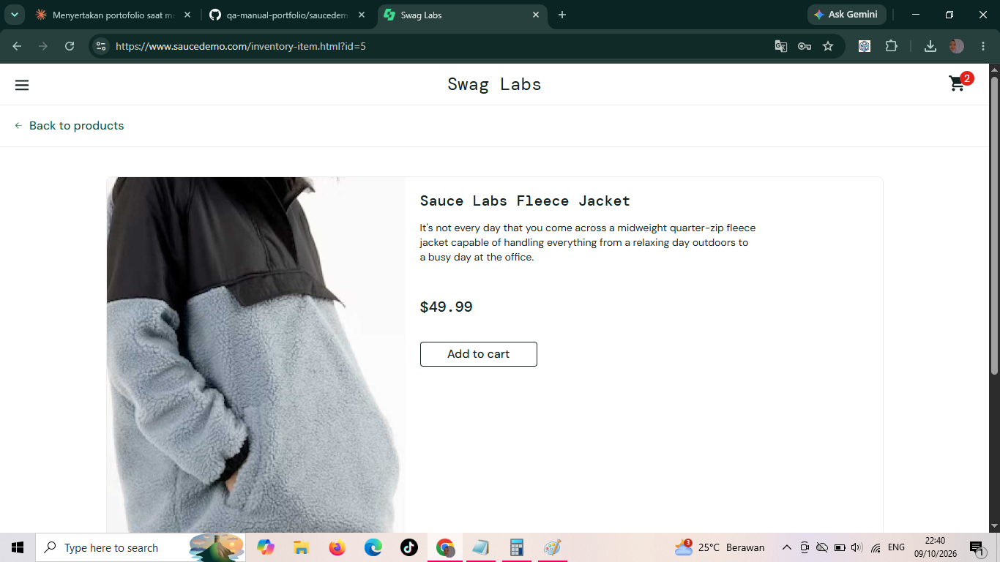

# BUG-002: Nama dan gambar di halaman detail tidak sama dengan produk yang diklik

| Keterangan | Detail |
|---|---|
| Aplikasi | SauceDemo (saucedemo.com) |
| Akun | problem_user |
| Environment | Chrome, Windows 11 |
| Severity | High |
| Status | Open |

## Langkah Reproduksi
1. Buka saucedemo.com
2. Login sebagai problem_user (password: secret_sauce)
3. Klik salah satu produk di halaman daftar produk
4. Bandingkan nama dan gambar di halaman detail dengan produk yang diklik

## Expected Result
Halaman detail menampilkan nama dan gambar yang sama dengan produk yang diklik.

## Actual Result
Nama dan gambar di halaman detail tidak sesuai dengan produk yang diklik, dan juga berbeda dari nama dan gambar di halaman daftar produk.

## Lampiran

